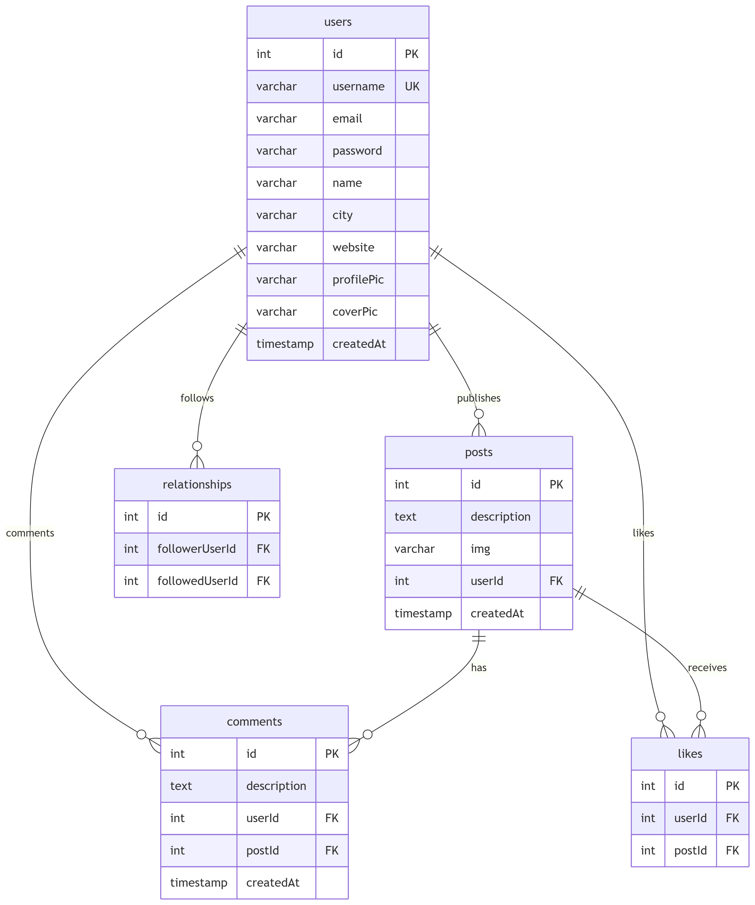

## Usage Instructions

Please avoid uploading large images. The server has limited resources—your understanding is appreciated.

### Environment Requirements

Please avoid uploading large images. The server has limited resources—your understanding is appreciated.

- Node.js
- MySQL

### Database Setup

Create a database named `social_media` in your MySQL server (either local or remote)

Import the `social_media.sql` file (found in the root directory) into the `social_media` database.

Open /service/connect.js and update the database configuration (host, username, password, etc.) to match your MySQL setup.

Incorrect configuration may result in database connection failures.

### Database Schema

Below is the entity-relationship diagram of the database structure:



### Install Dependencies

Since both the frontend and backend rely on Node.js, install dependencies for both:

cd client, then enter：npm i

cd ../service，then enter：npm i

> If prompted to upgrade your Node.js version, please do so accordingly.

### Run Locally

After setting up everything above, run the project:

cd client，then enter：npm run start

cd service，then enter：npm run dev

############################################################

（If you do not intend to deploy the project online, you may skip the following section.）

############################################################

### Modify Image Storage Path

In /service/index.js, update the image upload destination:

From：

cb(null, "../client/public/upload");
// cb(null, "./public/upload");

To：

// cb(null, "../client/public/upload");
cb(null, "./public/upload");

### Update API Endpoint URLs for Production

When deploying online, you must manually update the API URLs from localhost to your domain.

#### /client/.env

find：/client/.env document，probably like this：

```text

http://localhost:8800/api

```

change it to：http://your-domain/api

#### /client/src/axios.js

change："http://localhost:8800/api"

to："http://your-domain/api"

#### /client/src/setupProxy.js

change："http://localhost:8800"

to："http://your-domain"

#### /client/src/pages/register/Register.jsx

change："http://localhost:8800/api/auth/register"

to："http://你的域名/api/auth/register"

### Deploy Online

cd client，then：npm run build

Copy the contents of the build folder into /service/public

Upload the entire `service` folder to your server，run the backend：npm run start
